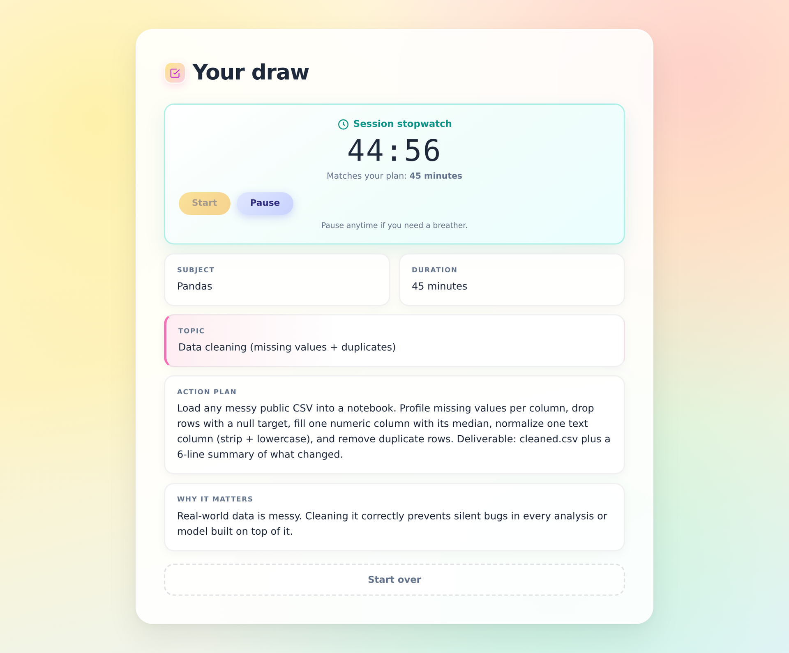

# Study Roulette 🎯

Can't decide what to study? List your subjects, spin, and get one concrete, timed study task generated by an LLM — not "review your notes," but a specific subtopic with clear steps and a deliverable.



## Features

- **Random subject draw** from a list of 2–10 subjects you enter
- **AI-generated study task** for the drawn subject: a specific subtopic, a time box (20–60 min), step-by-step task with a deliverable, and why it matters
- **Built-in countdown timer** that starts from the task's time box
- **Hardcore mode** — adds a strict rule to the task, disables pausing the timer, and removes the "start over" escape
- **Quality guardrails** — responses are validated server-side; generic tasks ("do exercises", "review notes") or wrong-subject answers are rejected and regenerated automatically

## How it works

```
Browser (index.html)  ──POST /api/generate──▶  FastAPI (main.py)  ──▶  LLM (OpenAI-compatible API)
        ▲                                            │
        └────────────── validated JSON task ◀────────┘
```

1. The frontend picks a subject at random and sends the full list plus the chosen subject to `/api/generate`.
2. The backend prompts the model to return a strict JSON task.
3. The response is parsed and checked: correct subject, all fields present, nothing generic, and a hardcore rule when hardcore mode is on.
4. If the check fails, the backend retries with a corrective instruction before giving up.

The LLM call runs in a worker thread so it doesn't block the async server.

## Tech stack

- **Backend:** Python, FastAPI, Pydantic, OpenAI Python SDK
- **Frontend:** single-file HTML/CSS/vanilla JS
- **Model:** any OpenAI-compatible provider (defaults to Llama 3.3 70B on Fireworks AI)

## Run locally

Requires Python 3.9+.

```bash
git clone https://github.com/SkipperAli/study-roulette.git
cd study-roulette

python -m venv .venv
# Windows
.venv\Scripts\activate
# macOS / Linux
source .venv/bin/activate

pip install -r requirements.txt
```

Copy `.env.example` to `.env` and add your API key:

```
OPENAI_API_KEY=your-api-key-here
```

Start the server:

```bash
uvicorn main:app --reload
```

Open http://127.0.0.1:8000.

### Using a different provider

Set `OPENAI_BASE_URL` and `OPENAI_MODEL` in `.env`. For example, OpenAI itself:

```
OPENAI_BASE_URL=https://api.openai.com/v1
OPENAI_MODEL=gpt-4o-mini
```

## API

| Method | Path | Description |
| ------ | ---- | ----------- |
| GET | `/` | Serves the app |
| GET | `/health` | Health check |
| POST | `/api/generate` | Generates a study task |

Example request:

```json
{
  "subjects": ["Pandas", "Linear Algebra", "Organic Chemistry"],
  "chosen_subject": "Pandas",
  "hardcore": false
}
```

Example response:

```json
{
  "subject": "Pandas",
  "topic": "Data cleaning (missing values + duplicates)",
  "time": "45 minutes",
  "task": "Load a messy public CSV, profile missingness, impute one numeric column with the median, standardize a text column, drop duplicates, and export cleaned.csv. Deliverable: cleaned.csv + a 6-line summary of what changed.",
  "why_important": "Real-world data is messy; cleaning it correctly prevents downstream analysis bugs.",
  "hardcore_rule": ""
}
```

Returns `503` with `{"error": "no_connection"}` if no API key is set or the model call fails.

## Project structure

```
study-roulette/
├── main.py            # FastAPI app, prompt, validation and retry logic
├── index.html         # Entire frontend (UI, draw animation, timer)
├── requirements.txt
├── .env.example
└── README.md
```

## Possible improvements

- Session history and streaks
- Weighting subjects by priority or exam dates
- Structured output / JSON mode instead of regex parsing the response
